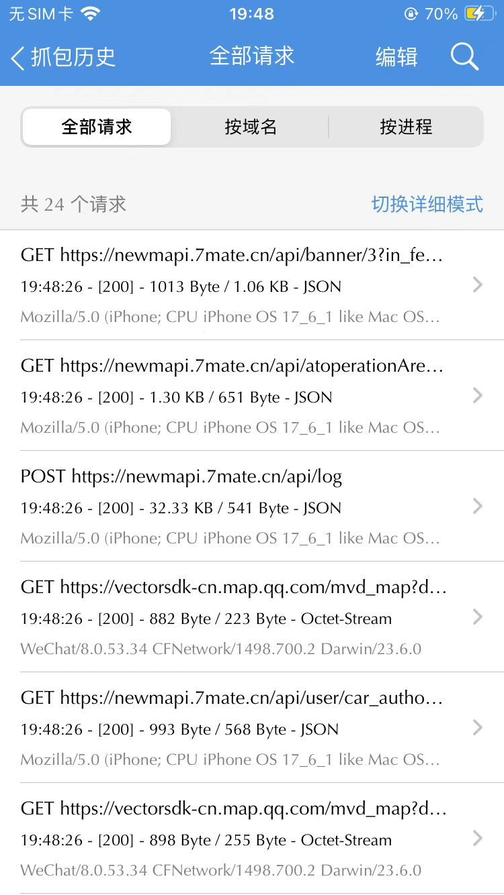
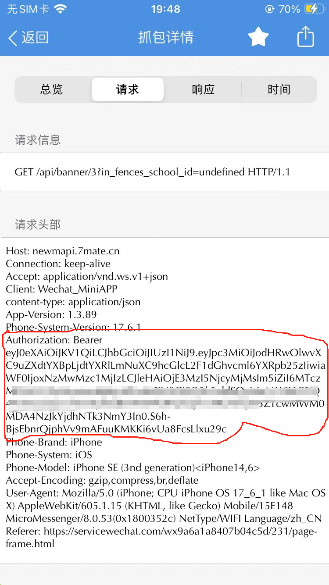
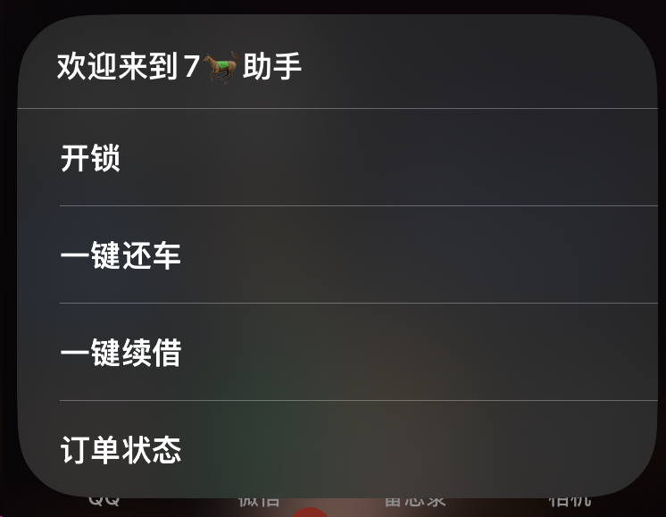

# 7MA-Helper

7MA助手：通过IOS快捷指令，实现功能包括扫码骑车，一键还车，一键续借，订单状态，连续锁车等功能。灵感来源[zhacha222/7ma: 7ma出行app，免费骑车](https://github.com/zhacha222/7ma)，并添加了一些实用的功能

## 功能

- [x] 扫码骑车
- [x] 一键还车
- [x] 一键续借
- [x] 订单状态
- [ ] 自动连续锁车
- [ ] 最近车辆显示
- [ ] 归还提醒

## 准备工作

通过链接 快捷方式，或者下载仓库的`.shortcut`文件。

打开快捷方式，可以看到一些需要补充的Token信息

这个Token需要我们去7ma微信小程序抓包得到，抓包使用`Stream`，开启`https抓包`模式，然后进7ma页面转一转。可以看到许多`7mate.cn`域名的请求

随便点击一个进去，看请求头中的`Authorization`的值，这就是我们的token，复制下来（不要复制Bearer）粘贴到快捷指令文本框中

## 使用

填写完以上信息就可以用了运行快捷指令后，选择对应的功能就可以使用了

### 开锁

和小程序的扫码功能一样，扫码开锁

### 一键还车

顾名思义，点击即可还车，因为还车的经纬度是通过get请求传的，所以可以无视位置直接还车。但是请不要乱停车！！！不仅增加运维人员工作量，同时对自己安全不负责任，害人害己。

### 一键续借

这个功能是给开卡用户使用的，开了不限次骑行卡一次可以骑20分钟，如果有时候需要使用超过20分钟，可以直接续借。

### 订单状态

查看正在进行的订单，信息包括车辆编号，开锁时间等

### 长时间锁车

不限次卡使用，通过计时器，每15分钟续借一次，实现长时间锁车，该功能目前正在开发中

## 优势

- 便捷，实测比打开微信小程序扫码快；同时还支持一键续借。

- 复用，7ma小程序下架之后，可以通过token的方式实现多人共用一张卡。

- 还车方便，停车区停满之后，这时候正常停车容易被判在停车区外，使用本程序可以直接还车。

  

## 贡献指南

我们欢迎所有形式的贡献，包括但不限于：

- 报告Bug
- 提出新功能建议
- 完善文档

请提交issue或pull request来参与项目改进。欢迎提出意见和增加功能。

## 免责声明

本快捷方式仅供学习交流使用，请勿用于任何非法用途。使用本快捷方式所产生的一切后果由用户自行承担。

## 许可证

本项目采用 [MIT 许可证](https://github.com/ITStudioOUC/OUC-JWGL-Helper/blob/master/LICENSE)。

## 联系方式

如有任何问题或建议，请通过以下方式联系我们：

- 提交GitHub Issue
- 发送邮件至：[admin@itstudio.club](mailto:admin@itstudio.club)

感谢您对7ma-Helper的支持！ 
